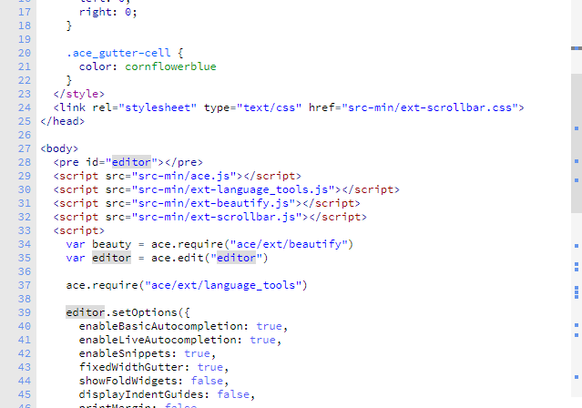

# Ace Editor Custom Scrollbar 

map search / highlight select on vertical scrollbar

CSS Scrollbars for [Ace Editor](https://github.com/ajaxorg/ace)

Ace demo https://ace.c9.io/build/kitchen-sink.html

---
ace kitchen-sink demo custom scrollbars did not work nice i think

so searched and found this one that worked better i think

changes to original ext-scrollbar.js https://github.com/ldijkman/Ace-Scrollbars/blob/master/src/ext-scrollbar.js

treid to change

offset if editor does not start at windowpos zero

from pixel position to percent positions

works a bit better on different font sizes

Ace Editor Custom ScrollBars Demo https://ldijkman.github.io/randomnerd_esp32_wifi_manager/mrs/create_from_scratch/Insane%20in%20the%20Membrane/ACE_Editor_JumpMarks_ScrollMarks.html

Ace Editor Custom ScrollBars Demo https://plnkr.co/edit/EYJWlWGjCdjNoui8?preview

Ace Editor Custom ScrollBars Demo https://codepen.io/ldijkman/pen/ZEVXOEv

---

Simple to use CSS styled scrollbars:

Just link to two files then initialise the scrollbars after initialising Ace.

    <link rel="stylesheet" type="text/css" href="ext-scrollbar.min.css">
    

    
### Added search/occurance map

Ace Editor Custom ScrollBars Demo https://plnkr.co/edit/EYJWlWGjCdjNoui8?preview

Ace Editor Custom ScrollBars Demo https://codepen.io/ldijkman/pen/ZEVXOEv

---

